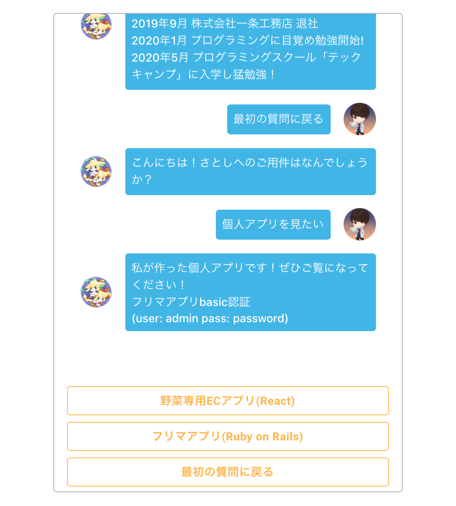
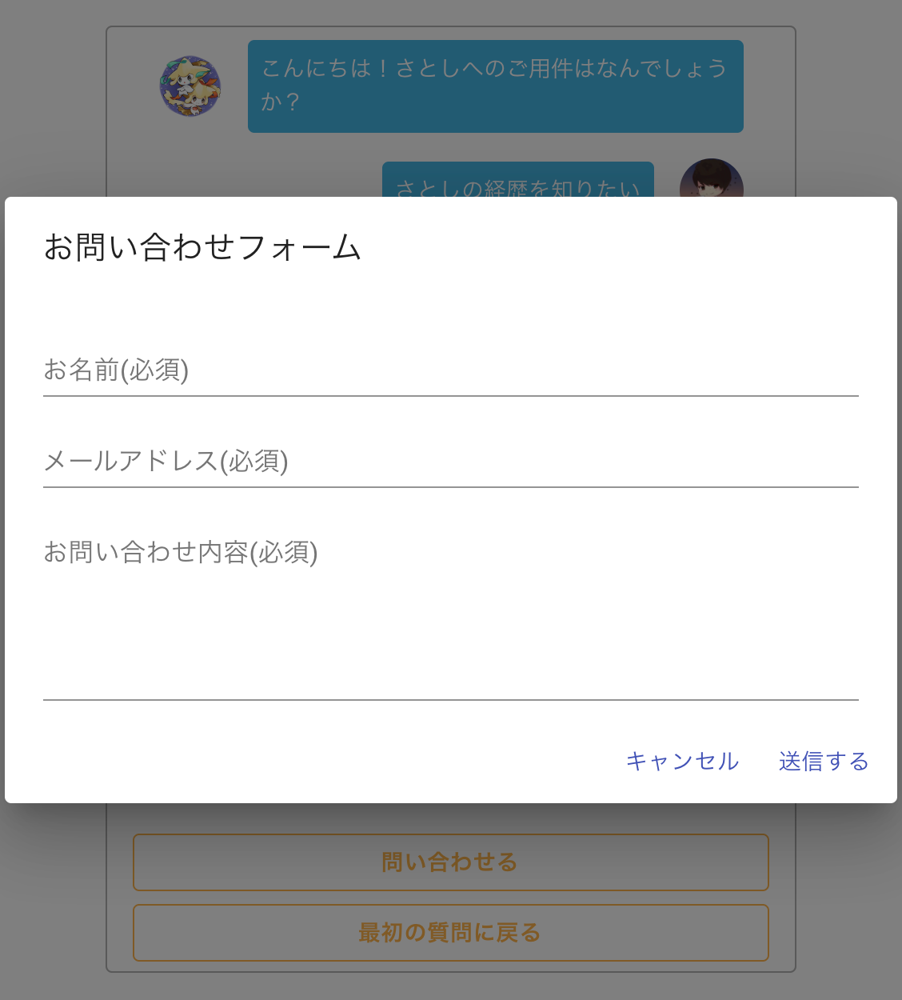

# チャットボット

## 概要
回答選択型のチャットボットアプリを作成しました。  
画面上部の質問に対して、画面下部の回答を選択していただくと、回答に応じた答えが表示されます。

### URL
<https://chatbot-demo-53ea1.web.app/>

## 使用技術
### フロントエンド
・HTML  
・CSS  
・JavaScript  
・React  
・React Hooks  
・Material-UI  

### インフラ・サーバーサイド・データベース
・Firebase  
・Cloud Functions  
・Firestore  

### 開発環境
・npm  
・create-react-app  

## 制作背景
チャットボットを通じて私の経歴、SNS、個人アプリ等をご覧いただくために作成しました。
Reactの学習の一貫として、簡易的なポートフォリオとしての役割を果たすことを目標として作成しました。

## 工夫した点
SlackのIncoming Webhookを使い、問い合わせモーダルを作成しました。
個人アプリを見ていただいて、私にご興味を持ってくださった方が連絡を取れるようにと思って作成しました。

# License
The source code is licensed MIT. The website content is licensed CC BY 4.0,see LICENSE.
